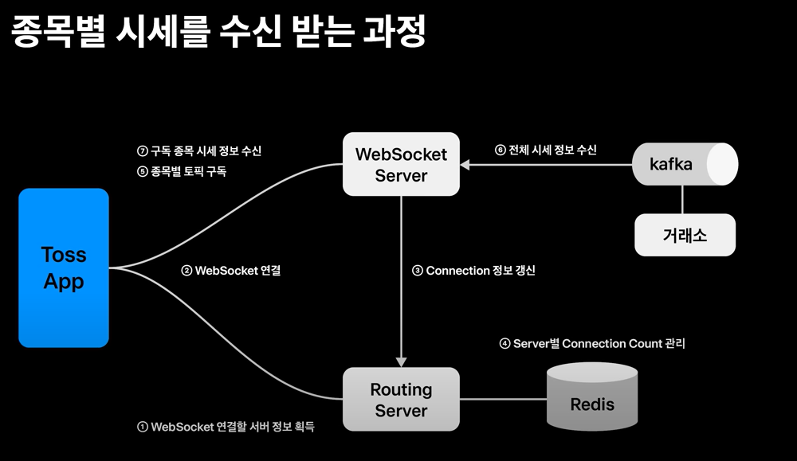

# 실시간 시세 적용기 

<!-- 1. 주문호가란  -->
## 주문호가
: 거래를 위해 서로 사거나 팔고 싶은 가격을 부르는 것 <br>
→ 일치하는 상대 주문이 있을 경우 거래가 성사! 

> 성사된 거래 가격들이 쌓인 것 = **주식 차트의 체결 시세**  
> 가장 최근의 체결 가격 = **현재가** 

증권투자자들은 자신에게 유리한 조건으로 거래를 하기 위해 <u>가장 최신의 정보를 근거로 호가를 결정</u>하길 원한다 <br>
이 때 가장 기본이 되는 정보 = **시세와 주문 호가** 

>사용자들 → **최신의 시세와 호가 정보를 제공하는 MTS**를 선호 <br>
증권사들 → 거래소나 시세 제공처로부터 **가능한 지연 없이 실시간으로 시세를 전달하는 기능을 제공**하고자 함 = 실시간 시세 

- 국내 종목: 모든 증권사에서 무료로 제공<br>
- 해외 주식: 많은 증권사에서 전월 실적에 따른 조건부 무료 혹은 유료로 제공

#### 토스 증권 → 해외 주식 포함 전체 종목의 실시간 시세 정보를 무료로 제공

<!-- 2. 실시간 시세 제공 위한 기술 -->
## 무료 실시간 시세 제공을 위한 기술
#### 초창기: 실시간이 아닌 <u>API Polling</u> 방식 
→ 토스증권의 UX가 주식 초심자들을 주요 대상으로 타겟팅하면서 시세 정보의 실시간성에 크게 민감하지 않을 것이라는 팀내 가설<br> 
→ 차트 등 UX 설계 과정에서 유명한 미국 주식 플랫폼 로빈후드팀의 MTS 제품을 벤치마킹 
= Polling 방식 채택 

#### '사용자에게 가능한 가장 최신의 정보를 제공해야 한다'는 의견
→ 주 타겟 층과 별개로 전체적인 사용자 경험을 생각하면 반드시 실시간 시세를 제공해야 한다

### 🚀 WebSocket 
Polling을 대체할 기술로 `Server Side Event`도 고려되었지만 향후 양방향 통신을 통한 기능 확대의 니즈가 있을 것이라 판단

- SSE가 더 방화벽 친화적 
- 패킷 검사 기능이 있는 방화벽에서 WebSocket을 처리하는데 문제가 있다는 것을 나중에서야 알게 됨<br>
→ 런칭 초기에 방화벽 관련한 이슈들을 겪었다 

단방향 통신인 시세 시스템은 SSE로도 충분히 고려해 볼만한 기술인 것 같다 

<!-- 3. 실시간 시세 적용 -->
## 토스증권 MTS에서 WebSocket 방식의 실시간 시세가 적용된 영역 
- **종목 상세에서 노출되는 차트를 비롯하여 호가창 그리고 그 외에 대부분 종목 정보에 노출되는 종목의 현재가 정보** 등 
- 기존에 구현된 Polling 방식 또한 주요하게 활용
- 웹 소켓 연결이 실패하거나 지연되는경우 혹은 연결 성공이더라도 시세 제공에 지연이 발생하는 경우 등 웹소켓 시스템이 비정상적인 상황 → Polling API가 Fallback 시스템으로서의 역할을 한다 
    - Fallback system → 런칭 초기 안정화 과정에서 역할 

### 실시간 시세 적용 
사용자들이 조금 더 빠르게 최근 시세 정보를 확인할 수 있게 됨 <br>
시각적으로도 보다 역동성 있는 모습 

<!-- ## 실시간 시세를 개발하면서 구축된 WebSocket 시스템을 활용한 재미있는 기능 
종목 상세에 동시에 보고 있는 사용자 수를 실시간으로 노출  -->

# 전체 시스템 아키텍쳐  


- 국내 시세 정보 → 모두 한국 거래소에서 생성되어 각 증권사로 제공<br>
- 해외 시세 정보 → 연합인포맥스라고 하는 금융 전문 업체로부터 제공 

Unix C 기반의 원장 시스템 <br>
Kubernetes Java 기반의 MTS Application 영역이 서로 다른 기술 스택으로 구성 

이러한 구조에서 원장에서 수신받은 시세 데이터를 Java 기반 애플리케이션을 거쳐 클라이언트까지 제공하기 위해서는 C 기반의 원장 시스템에서 Java 애플리케이션으로 시세를 전달하기 위한 매개체가 필요했다 → **Kafka**를 활용 

> 시세를 수신받아 적재하는 과정에서 Kafka에서 WebSocket 서버로 송신 → 해당 WebSocket 서버에 수신하여 클라이언트까지 시세를 전달하는 방식 

## 망분리 요건을 고려한 인프라 구조 


[인프라 구조]
- **WebSocket** 서버를 **DMZ(Demilitarized Zone) 영역**에 배치  
→ N개의 서버가 각각 고유한 호스트 명을 가지도록 했다 

- 로드밸런싱 및 라우팅 역할을 위한 **라우팅서버**를 별도로 구성하여 <u>서버-클라이언트 간 연결 정보를 Redis를 통해 관리</u>하도록 함 

> 이렇게 구조를 짠 이유 
1. 전자금융감독규정의 망분리 요건 준수 
2. WebSocket 서버 상단의 네트워크 홉을 줄이기 위함 

## WebSocket 서버


> **Spring WebSocket과 Stomp Protocol을 활용**하여 구현<br>
→ WebSocket에서 별도의 프로토콜 구현 없이 빠르게 PUB/SUB 기능을 구현하기에 가장 좋은 선택지 

토스 증권에서 사용되는 Topic은 목적지가 종목 코드인 유형, 사용자인 유형 크게 두 가지로 구분
- 종목 코드 유형의 Topic은 종목의 현재가, 호가, 시장정보 등의 정보를 전달하기 위한 목적 
- 사용자 유형은 보유종목 등 개인 자산의 갱신을 위한 용도로 활용 

## 실제 유저가 시세를 수신 받기까지의 과정 


클라이언트는 먼저 라우팅 서버를 통해 연결할 WebSocket 서버의 호스트 정보 획득 

획득한 WebSocket 서버로 연결 시도 

```javascript
if(실패 시) { 
    Polling 방식의 API를 호출 
} else {
    성공 시 WebSocket 서버는 갱신된 커넥션 정보를 라우팅 서버까지 전달 
}
```

라우팅 서버는 로드 밸런싱을 위한 서버별 커넥션 정보를 Redis에서 관리 

클라이언트는 WebSocket을 통해 화면에 노출되는 종목들에 대해 필요한 토픽을 구독 요청 

WebSocket 서버에서 거래소로부터 수신된 시세 정보를 Kafka를 통해 전달받아 각 종목을 구독하고 있는 클라이언트로 시세 정보를 전달

## 사용자의 수신 정보를 갱신하는 과정 

$*$ 종목 정보 수신과는 조금 다르다<br> 
실제 갱신된 자산 정보를 WebSocket을 통해 직접 전달하고 있지는 않고 자산 정보의 갱신 신호를 주는 방식으로 활용 


초기 연결과정은 기존과 동일하지만

WebSocket 접속을 위한 Handshake 과정에서 사용자 ID를 획득 

WebSocket 서버가 Routing 서버에 커넥션 정보를 전달하면 사용자 ID를 기준으로 사용자별 접속 서버 정보를 Redis에 관리하게 됨 

원장에서 매매체결 혹은 입출고 등으로 자산 정보의 변경이 발생하면 라우팅 서버에 해당 이벤트를 전달 

라우팅 서버는 사용자별 접속 정보를 기준으로 실제 사용자가 연결된 WebSocket 서버에 해당 정보를 포워딩하게 된다 

WebSocket 서버는 해당 사용자에게 자산 정보 갱신을 지시

사용자는 자산 API 조회를 통해서 갱신된 최신 자산 정보를 조회할 수 있게 됨 

## Kafka Latency 최적화 


C 기반의 원장 시스템으로부터 시세를 전달받기 위해 Kafka를 적용하면서 latency 최적화가 필요

Kafka 클라이언트에서 latency 개선을 위해 설정값으로 튜닝할 수 있는 요소는 compression type과 acks 설정 두 가지 

- compression type: 압축 알고리즘의 효율과 데이터의 성격에 따라서 더 좋은 성능이 결정
- acks: 안정적인 데이터 저장 욕구와 성능의 트레이드 오프를 컨트롤 할 수 있는 설정 

### acks
all은 leader와 replica에 모두 저장이 완료되면 응답하는 방식
1은 leader에만 저장되면 응답
0은 leader에 저장됨도 확인하지 않고 바로 등답하는 방식 
→ all과 1일 때 약 5.7배 정도의 평균 latency 차이를 보였다 
> acks는 1로 설정 

### Compression type
> lz4가 가장 좋은 결과를 보여주었다 (Producer와 Consumer를 모두 고려한 결과)

---  

# 런칭 이후 트러블 슈팅 


## MTS의 트래픽 특성 
장 시작과 동시에 약 2~3분 이내에 그 날 최대 트래픽 발생 

### 1. Load Balancing 방식에 따른 Connection 지역

초기 런칭 시 Least Connection 방식으로 로드 밸런싱 <br>
→ 장 시작과 동시에 너무 많은 사용자가 몰리며 문제 발생 

- 서버 간 커넥션 분산은 잘 이루어졌지만 순간적으로 특정 서버에 다수의 커넥션이 몰리는 현상 발생 → 해당 서버의 CPU 사용량이 증가 & 커넥션 지연이 발생하는 원인 
- 커넥션 정보 갱신을 위한 HTTP API 요청을 최소화하기 위해 매 연결/종료 시마다 갱신하지 않고 0.5초 주기로 갱신하다 보니 갱신 주기 사이에 몰림 현상이 더 두드러지게 나타남 

#### 큰 트래픽이 발생하는 시점에 이를 적절히 분산하는 것이 서버 관점에서 얼마나 중요하고 이것을 소홀히 했을 때 어떤 장애로 이뤄질 수 있는지 고민해 봐야 함 

### 2. WebSocket Connection Leak 

- WebSocket 서버의 배포나 재시작이 없는 경우 짧게는 수일에서 길게는 일주일 정도가 지나면 WebSocket 서버군의 커넥션이 점진적으로 증가해 HTTP API 요청 집계 방식으로 측정한 동시접속자 수와 큰 폭의 차이가 나는 현상 

- 정상 종료 시에는 문제가 없었으나 Abnormal 이벤트 발생 시에 정상적으로 종료되지 않는 현상 

> WebSocket의 경우 현업에서 활용할 때마다 Connection Leak 등 **세션 Close와 관련된 문제들**을 적잖이 겪게 됨!

#### 네트워크가 자주 변경되는 모바일 환경의 특성상 예기치 않은 다양한 종료 이벤트가 발생하기 때문에 이러한 부분들을 적절히 처리해 주어야만 문제 없이 WebSocket 기능 활용 가능 

### 3. 트래픽 증가와 방화벽 처리량의 한계 

이벤트의 성공으로 예상보다 빠른 시점에 큰 트래픽을 겪으면서 발생한 이슈 
→ 사용자 트래픽이 급증하면서 실시간 시세 서버 또한 팀에서 에측했던 것보다 훨씬 더 큰 유저 트래픽을 겪게 된다 

#### 대량의 데이터가 오가는 WebSocket 기능을 고려할 때는 방화벽과 보안 장비의 처리량 또한 잘 고려되어야 함 

### 4. Scale out의 어려움 

